## Linked Lists

- aim is to store items effeciently (insertion and removal operations)

### Singly Linked List

  

- we have access to the first node of the linked list (Head), and other items can be accessed starting with this node. Each node is pointing to the next node until end.
- last node (Tail) is pointing to a null value.
- every node stores the **data** itself and a **reference** to the next node in the linked list data structure. This is why linked lists require more memory than arrays.
- has an advantage: there cannot be holes in the data structure, so there is no need for shifting items, since we are using linkes between the items.
- **no random indexing** as the items are not stored next to each other in the memory.
- Complexity with Linked List:
    - to find an arbitrary item in linked list, still has **O(n)** running time complexity.
    - manipulating an arbitrary item: **O(n)** linear running time complexity

|                                | Access    | Search    | Insert    | Delete    |
|--------------------------------|-----------|-----------|-----------|-----------|
| manipulating an arbitrary item |   O(n)    |   O(n)    |   O(n)    |   O(n)    |
| manipulating the first item    |   O(1)   *|   O(1)   *|   O(1)   *|   O(1)   *| 

- Pros and Cons of Singly Linked Lists

  

### Singly Linked lists in Java !!!

- In a singly linked list we store a reference to the first node (head node) exclusively. Which means that if we want to insert items to the end of the linked list then we have to iterate through the list first - this is why it takes O(N) running time.
- **BUT IN JAVA'S LINKED LIST, THERE IS A REFERENCE TO THE LAST NODE OF THE LINKED LIST AS WELL !!!**
- It means of course that inserting items to the end of the linked list (and removing items from the end of a linked list) takes O(1) constant running time complexity.

[`simple-integer-linkedlist`](../LinkedList/java/simple_integer_linkedlist/)
[`generic-linkedlist`](../LinkedList/java/generic_linkedlist/)

### Singly Linked lists in Python !!!

[`singly_linked_list.py`](../LinkedList/python/linkedlist/singly_linked_list.py)

### Doubly Linked List

[`doubly-linked-list`](../LinkedList/java/doubly_linked_list/)

  

### Java's built-in LinkedList data structure

- https://docs.oracle.com/javase/8/docs/api/java/util/LinkedList.html
- **Doubly-linked list implementation** of the List and Deque interfaces. Implements all optional list operations, and permits all elements (including null). Allows addFirst(E e), addLast(E e) which has O(1).

[`built-in LinkedList data-structure`](../LinkedList/java/built-in_linked-list_data-structure/)

### Circular Linked List

## Arrays Vs LinkedLists

|            Arrays            |          LinkedLists           |
|------------------------------|--------------------------------|
| Static Data Structure        | Dynamic Data Structure         |
| Random access (indexes)      | No Random access               |
| Manipulate first item O(n) - have to shift several items | Manipulate first item - update the references      |
| Manipulate last item -  there cannot be holes            | Manipulate last item - traverse whole list O(n) |
| Memory management - do not need extra memory             | Memory management - need extra memory(references)    |

- searching (removing) an arbitrary item (when we do not know the index of the item: arrays) takes O(n) linear running time complexity - **main disadvantage** of arrays and linked lists.

## Java's ArrayList vs LinkedList running time comparison

[`Comparison_ArrayList_LinkedList`](../App.java)

## Linked lists real world applications:

 - low level memory management (heap management)
 - applications of Windows OS: several tabs (applications) opened, alt+tab
 - photo viewer application - next photo, prev photo
 - blockchains (BitCoin) - blocks are cryptographically linked together by hash values

 ## Interview questions

 - Find Middle Node without the need of extra memory: [`Exercise`](../LinkedList/java/exercise/FindMiddleNode.java) [`Example`](../LinkedList/java/example/FindMiddleNode.java)
    1. naive solution (traverses twice through the linked list - slow)
        - iterate through the list and count how many elements there are in total
        - traverse the list again and the node with index **count/2** is the middle node
    2. Using 2 pointers (traverses once through the linked list - fast)
        - use 2 pointers to get the middle node in O(n)
            - Pointer 1: traverse the linked list one node at a time
            - Pointer 2: traverse the linked list two nodes at a time
        - when the faster pointer reaches the end of the list, then the slower pointer is pointing to the middle node

- Reverse a linked list: construct an **in-place** algorithm: [`Exercise`](../LinkedList/java/exercise/ReverseLinkedList.java) [`Example`](../LinkedList//java/example/ReverseLinkedList.java)
    1. naive solution
        - consider all the nodes one by one, then construct another linked list in reverse order.
        - problem: it has O(n) memory complexity, so it is not **in-place**
    2. using pointers
        - we can achieve an **in-place** algorithm that has **O(n)** linear running time complexity as well
        - need 3 pointers: for current, previous, next nodes
        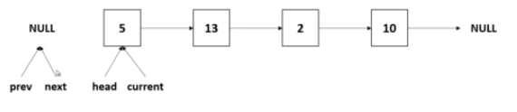 
        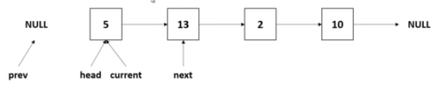 
        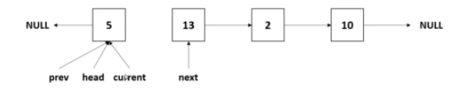 
        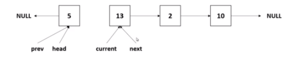 
        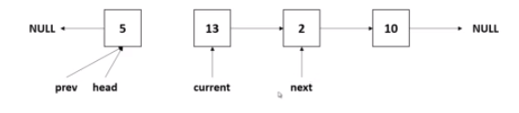 
        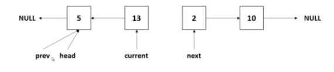 
        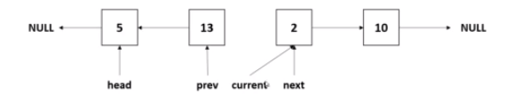 
        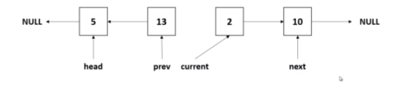 
        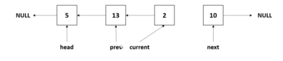 
        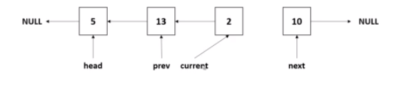 
        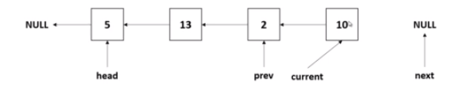 
        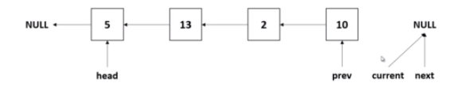 
        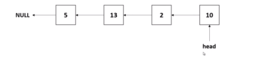 
    